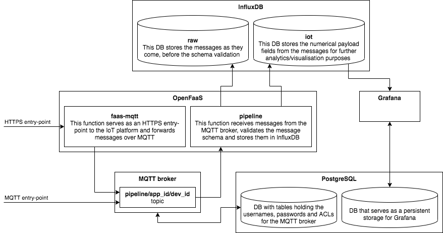

# Internet-of-Things Platform for Sensemakers by SURF

The [IoT Sensemakers Amsterdam](https://www.sensemakersams.org/) community makes use of an Internet-of-Things platform developed by and hosted at [SURF](https://www.surf.nl/en).
The platform supports sending data over MQTT and HTTPS protocols, storing data in the InfluxDB time-series database and visualisations in Grafana.

Check out:
- the [user guide](USER_GUIDE.md)
- public dashboards at https://grafana.sensemakersams.org/
- examples in this repository

